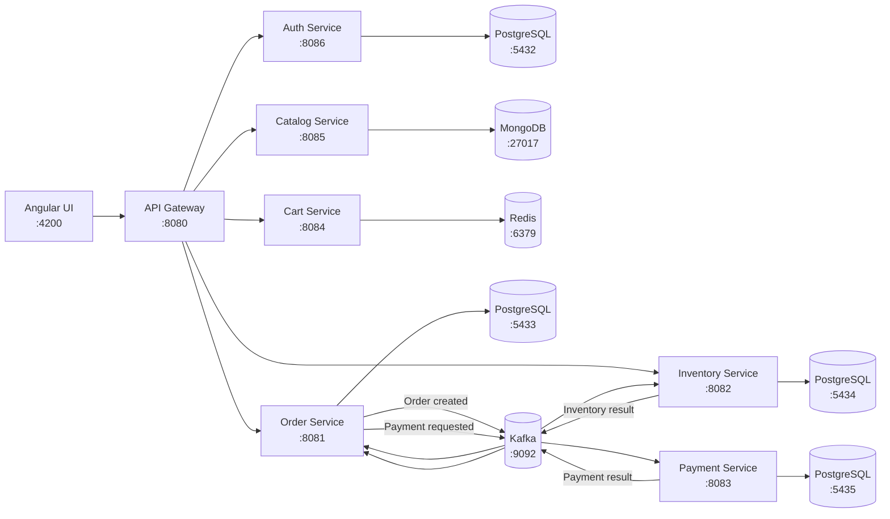

# FlashSale

FlashSale is an event-driven microservices application that models a small e-commerce flash-sale workflow. It includes product discovery, shopping cart management, checkout, inventory reservation, payment processing, authentication, and order tracking.

The backend is split into independently runnable Spring Boot services. Kafka coordinates the order workflow, while PostgreSQL, MongoDB, and Redis provide service-owned persistence. An Angular application provides the customer-facing UI.

## Architecture



Each service owns its data store. Cross-service order processing is asynchronous and event-driven rather than implemented as one distributed database transaction.

## Technology stack

- Java 21
- Spring Boot and Spring Cloud Gateway
- Gradle Wrapper
- Angular 21 and Angular Material
- PostgreSQL 16
- MongoDB 7
- Redis 7
- Apache Kafka with ZooKeeper
- Flyway database migrations
- Docker Compose

## Repository structure

```text
flashsale/
├── infra/
│   └── docker-compose/
│       └── docker-compose.yml
├── services/
│   ├── api-gateway/
│   ├── auth-service/
│   ├── cart-service/
│   ├── catalog-service/
│   ├── inventory-service/
│   ├── order-service/
│   └── payment-service/
└── ui/
    └── flashsale-ui/
```

## Services and ports

| Component | Port | Responsibility | Data dependency |
| --- | ---: | --- | --- |
| Angular UI | `4200` | Customer storefront and catalog management | API Gateway |
| API Gateway | `8080` | Single HTTP entry point and CORS | Backend services |
| Order Service | `8081` | Order creation and order lifecycle | PostgreSQL, Kafka |
| Inventory Service | `8082` | Stock reservation | PostgreSQL, Kafka |
| Payment Service | `8083` | Payment processing | PostgreSQL, Kafka |
| Cart Service | `8084` | Per-user shopping carts | Redis |
| Catalog Service | `8085` | Product catalog and search | MongoDB |
| Auth Service | `8086` | Registration, login, and JWTs | PostgreSQL |
| Auth PostgreSQL | `5432` | Auth data | Docker Compose |
| Order PostgreSQL | `5433` | Order data | Docker Compose |
| Inventory PostgreSQL | `5434` | Inventory data | Docker Compose |
| Payment PostgreSQL | `5435` | Payment data | Docker Compose |
| Redis | `6379` | Cart data | Docker Compose |
| MongoDB | `27017` | Catalog data | Docker Compose |
| Kafka | `9092` | Domain events | Docker Compose |
| ZooKeeper | `2181` | Kafka coordination | Docker Compose |

## Prerequisites

Install the following before running the project:

- Docker Desktop with Docker Compose
- JDK 21
- Node.js and npm

Verify the tools:

```bash
docker --version
docker compose version
java --version
node --version
npm --version
```

## Running the project

Run all commands from the repository root unless a step says otherwise.

### 1. Start infrastructure

```bash
docker compose -f infra/docker-compose/docker-compose.yml up -d
```

Check the containers:

```bash
docker compose -f infra/docker-compose/docker-compose.yml ps
```

The PostgreSQL containers have health checks. Give Kafka, MongoDB, and Redis a few seconds to finish starting before launching the application services.

### 2. Start all backend services

The following command starts every Spring Boot service concurrently in the current terminal:

```bash
services=(
  auth-service
  catalog-service
  cart-service
  inventory-service
  payment-service
  order-service
  api-gateway
)

pids=()

cleanup() {
  kill "${pids[@]}" 2>/dev/null
}

trap cleanup INT TERM EXIT

for service in "${services[@]}"; do
  (
    cd "services/$service"
    ./gradlew bootRun
  ) &
  pids+=("$!")
done

wait
```

The output from the services will be interleaved. Press `Ctrl+C` to interrupt the command. For easier log inspection during development, start each service in its own terminal instead:

```bash
cd services/catalog-service
./gradlew bootRun
```

Replace `catalog-service` with the service you want to run.

### 3. Start the UI

Open another terminal:

```bash
cd ui/flashsale-ui
npm install
npm start
```

Open [http://localhost:4200](http://localhost:4200). The UI sends API requests to the gateway at `http://localhost:8080`.

### 4. Use the catalog UI

- Open [the storefront](http://localhost:4200/products) to search, filter, sort,
  page through products, open shareable product details, and add a chosen quantity
  to the cart.
- Open [Catalog Manage](http://localhost:4200/catalog-admin) to sign in with an
  `ADMIN` account. From there you can create hidden drafts, preview the
  customer-facing content, edit products, and publish or hide them.
- Registration creates a `USER` account. Follow the
  [local administrator setup](docs/catalog-backend.md#getting-an-administrator-token-locally)
  before using the management screen with a new account.

## Verifying the system

For browser-based API testing, restart the services after reloading Gradle and
open [Swagger UI](http://localhost:8080/swagger-ui/index.html). Use the service
dropdown to test each backend. See [Swagger API testing](docs/swagger-api-testing.md)
for direct service URLs, login instructions, and the Catalog testing flow.

Check the gateway:

```bash
curl http://localhost:8080/actuator/health
```

Check an individual service by using its port:

```bash
curl http://localhost:8085/actuator/health
curl http://localhost:8084/actuator/health
curl http://localhost:8081/actuator/health
```

Inspect infrastructure logs when a dependency is not ready:

```bash
docker compose -f infra/docker-compose/docker-compose.yml logs -f kafka
```

## Request routing

The UI calls the API Gateway, which routes requests by path:

| Gateway path | Destination |
| --- | --- |
| `/auth/**` | Auth Service |
| `/products/**` | Catalog Service |
| `/cart/**` | Cart Service |
| `/orders/**` | Order Service |
| `/inventory/**` | Inventory Service |

The Inventory Service runs on port `8082`. Verify that the inventory route in `services/api-gateway/src/main/resources/application.yaml` points to `http://localhost:8082`.

## Order workflow

1. The customer creates an order through the Order Service.
2. The Order Service persists the order and publishes an order-created event through its outbox flow.
3. The Inventory Service consumes the event and attempts to reserve stock.
4. The Inventory Service publishes an inventory result.
5. If inventory is available, the Order Service publishes a payment request.
6. The Payment Service processes the request and publishes a payment result.
7. The Order Service updates the final order status.

This workflow is eventually consistent. A newly created order may remain pending briefly while Kafka events are processed.

## Configuration

Service configuration is stored in each service's `src/main/resources/application.yaml` file.

Important development defaults include:

- All services connect to infrastructure through `localhost`.
- The Angular application expects the API Gateway at `http://localhost:8080`.
- The gateway allows CORS requests from `http://localhost:4200`.
- Database migrations run automatically through Flyway for PostgreSQL-backed services.
- Docker volumes preserve local database state between restarts.

The credentials and JWT secret currently committed in the configuration are development values. Use environment variables or a secrets manager before deploying the system outside a local development environment.

## Building and testing

For Catalog product management, authenticated API examples, and its isolated
database tests, see [Catalog backend](docs/catalog-backend.md).

Build or test a backend service from its directory:

```bash
./gradlew build
./gradlew test
```

Build or test the Angular application:

```bash
cd ui/flashsale-ui
npm run build
npm test
```

## Stopping the project

Stop foreground Spring Boot and Angular processes with `Ctrl+C` in their terminals.

Stop the infrastructure containers:

```bash
docker compose -f infra/docker-compose/docker-compose.yml down
```

To also remove persisted development data, including database and Redis volumes:

```bash
docker compose -f infra/docker-compose/docker-compose.yml down -v
```

The `-v` command permanently deletes local container-managed development data.

## Troubleshooting

### A service cannot connect to its database

Confirm the infrastructure container is running and healthy:

```bash
docker compose -f infra/docker-compose/docker-compose.yml ps
```

Then compare the service's datasource port with the port table above.

### Orders stay pending

Check Kafka first, followed by the Order, Inventory, and Payment service logs:

```bash
docker compose -f infra/docker-compose/docker-compose.yml logs kafka
```

Also confirm that the three event-driven services use `localhost:9092` as their Kafka bootstrap server.

### The UI loads but API requests fail

Confirm that:

- the API Gateway is running on port `8080`;
- the requested downstream service is running;
- the UI is served from `http://localhost:4200`;
- no other process is already using the required port.

### A port is already in use

On macOS or Linux, identify the process using a port:

```bash
lsof -i :8080
```

Replace `8080` with the conflicting port.
